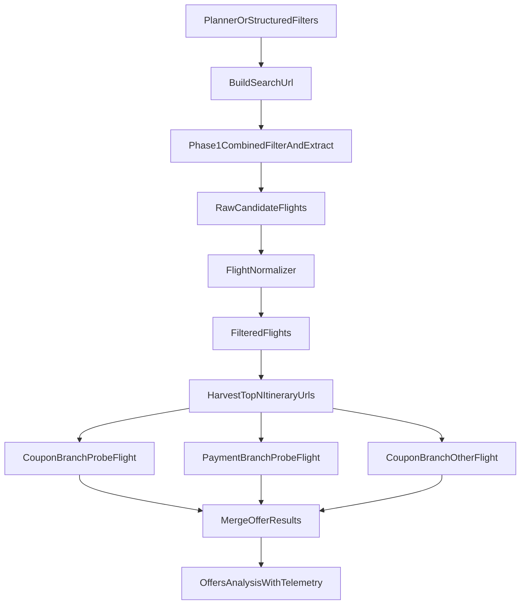

# FareWise — Architecture Deep Dive
> Two-Layer Design · Amazon Nova Model Pipeline · WebSocket Streaming · Three Surfaces

**Version:** 1.4 (updated March 2026 — merged single-act filter+extract, 33% faster Cleartrip pipeline)

---

## The Core Question: Why Two Layers?

> *"Nova Act is already an agent framework — why do we need a separate orchestrator?"*

This is the right question, and the answer explains the entire architecture.

### What Nova Act IS (and isn't)

**Nova Act** is a **single-site browser automation agent**:
- Controls ONE real Chromium browser instance
- Navigates ONE website per session
- Executes natural language instructions on that page
- Returns structured data (JSON schema output)
- Runs **synchronously** — one step at a time on one page

```python
# Nova Act: one site, one session, one browser
with NovaAct(starting_page="https://www.amazon.in/s?k=Sony+WH-1000XM5") as agent:
    data = agent.act("Extract the top 5 listings", schema={...})
```

Nova Act cannot:
- Coordinate multiple sites simultaneously
- Make Bedrock API calls (Nova Lite, Nova Pro, etc.)
- Stream progress over WebSocket
- Handle partial failures across multiple agents
- Chain different AI models together

### What the Orchestrator Adds

**Our Orchestrator** is a **coordination and intelligence layer**:

| Concern | Nova Act | Orchestrator |
|---|---|---|
| Single-site browsing | ✅ Built-in | — |
| Multi-site parallel execution | ❌ Not possible | ✅ `ThreadPoolExecutor` |
| Nova Lite / Pro / Sonic calls | ❌ Not possible | ✅ Direct Bedrock API |
| WebSocket progress streaming | ❌ Not possible | ✅ Async generator |
| Partial failure handling | ❌ Not possible | ✅ Try/except per agent |
| Card offer calculation | ❌ Not possible | ✅ Nova Pro reasoning |
| Voice I/O | ❌ Not possible | ✅ Nova Sonic + Polly |

**The two layers are complementary, not redundant.** Nova Act handles the browser autonomously per site; the orchestrator coordinates across sites and across Amazon Nova models.

---

## Architecture Diagram

```
┌─────────────────────────────────────────────────────────────────────┐
│                    FRONTEND SURFACES (3)                             │
│                                                                      │
│  ┌──────────────────┐  ┌───────────────────┐  ┌──────────────────┐  │
│  │  Chrome Extension│  │   Web App / PWA   │  │   Mobile PWA     │  │
│  │  (Side Panel)    │  │   (Marketing +    │  │   (Camera +      │  │
│  │  380px sidebar   │  │    Live Demo)     │  │   WhatsApp share)│  │
│  │  Manifest V3     │  │                   │  │                  │  │
│  └────────┬─────────┘  └────────┬──────────┘  └────────┬─────────┘  │
└───────────┼─────────────────────┼──────────────────────┼────────────┘
            │                     │                      │
            └─────────────────────┼──────────────────────┘
                                  │ HTTPS + WebSocket
                                  │
┌─────────────────────────────────▼───────────────────────────────────┐
│                         FastAPI Backend                               │
│                                                                       │
│  REST Endpoints:                  WebSocket:                          │
│  POST /api/products/identify      WS /ws/search/{task_id}            │
│  POST /api/products/search        (streams progress in real-time)    │
│  POST /api/travel/search          WS /api/voice/ws                   │
│  POST /api/travel/parse-voice     (Nova Sonic voice session)         │
│  GET  /health                                                         │
└──────────────┬──────────────────────────────┬───────────────────────┘
               │                              │
   ┌───────────▼────────────┐   ┌─────────────▼──────────────────────┐
   │   NOVA MODEL LAYER     │   │      NOVA ACT AGENT LAYER          │
   │                        │   │                                    │
   │  nova/identifier.py    │   │  ThreadPoolExecutor (max 5 workers)│
   │  ┌────────────────┐    │   │                                    │
   │  │  Nova Lite     │    │   │  Products Mode (2 agents):         │
   │  │  nova-lite-v1  │    │   │  ┌──────────────────────────────┐  │
   │  │  Reads text    │    │   │  │ agents/amazon/               │  │
   │  │  from image    │    │   │  │ NovaAct → amazon.in          │  │
   │  └────────────────┘    │   │  │ Returns: price, offers, ETA  │  │
   │                        │   │  └──────────────────────────────┘  │
   │  nova/planner.py       │   │  ┌──────────────────────────────┐  │
   │  ┌────────────────┐    │   │  │ agents/flipkart/             │  │
   │  │  Nova Lite     │    │   │  │ NovaAct → flipkart.com       │  │
   │  │  nova-lite-v1  │    │   │  │ Returns: price, offers, ETA  │  │
   │  │  NL query →    │    │   │  └──────────────────────────────┘  │
   │  │  plan+filters  │    │   │                                    │
   │  └────────────────┘    │   │  Travel Mode (3 agents):           │
   │                        │   │  ┌──────────────────────────────┐  │
   │  nova/validator.py     │   │  │ agents/makemytrip/           │  │
   │  ┌────────────────┐    │   │  │ NovaAct → makemytrip.com     │  │
   │  │  Nova Multi-   │    │   │  └──────────────────────────────┘  │
   │  │  modal Embed.  │    │   │  ┌──────────────────────────────┐  │
   │  │  Cosine sim.   │    │   │  │ agents/ixigo/                │  │
   │  │  validation    │    │   │  │ NovaAct → ixigo.com          │  │
   │  └────────────────┘    │   │  └──────────────────────────────┘  │
   │                        │   │  ┌──────────────────────────────┐  │
   │  nova/reasoner.py      │   │  │ agents/cleartrip/            │  │
   │  ┌────────────────┐    │   │  │ NovaAct → cleartrip.com      │  │
   │  │  Nova Pro      │    │   │  └──────────────────────────────┘  │
   │  │  nova-pro-v1   │    │   │                                    │
   │  │  Price calc +  │    │   │  agents/orchestrator.py            │
   │  │  card offers   │    │   │  nova/flight_normalizer.py         │
   │  └────────────────┘    │   │  Parallel exec + dedup + filter    │
   │                        │   └────────────────────────────────────┘
   │  routers/voice.py      │
   │  ┌────────────────┐    │
   │  │  Nova Sonic    │    │
   │  │  (via Polly    │    │
   │  │   for MVP TTS) │    │
   │  └────────────────┘    │
   └────────────────────────┘
                   │                              │
                   └──────────────┬───────────────┘
                                  │ Both layers feed into
                                  ▼
                        data/card_offers.json
                        (bank card offer database)
```

---

## Products Mode — Complete Pipeline

```
Step 1: INPUT
  WhatsApp screenshot (paste) / product name (text) / voice

Step 2: NOVA LITE IDENTIFICATION  [nova/identifier.py]
  Model: us.amazon.nova-lite-v1:0
  Input: base64 image bytes
  Does:  - Reads all visible text (OCR + knowledge)
         - Identifies brand, model number, variant
         - Assigns confidence: high / medium / low
  Output: { product_name, model_number, brand, search_query, confidence }
  Time:  ~2 seconds

Step 3: NOVA MULTIMODAL EMBEDDING  [nova/validator.py]
  Model: amazon.nova-multimodal-embeddings-v1
  Input: user image + up to 10 search result thumbnails
  Does:  - Embeds user image into vector space
         - Embeds each result thumbnail
         - Cosine similarity → filters to best matches (threshold: 0.72)
  Output: validated results list (wrong SKU variants filtered out)
  Time:  ~3-5 seconds (parallel embedding calls)

Step 4: NOVA ACT PARALLEL SEARCH  [agents/orchestrator.py]
  Workers: ThreadPoolExecutor(max_workers=5)
  Agents run simultaneously:
  ┌─────────────────────────────────────────────────────┐
  │  Thread 1: AmazonAgent.search(query)                │
  │  ├── NovaAct(starting_page=amazon.in/s?k=...)       │
  │  ├── agent.act("Extract top 5 listings", schema=..) │
  │  └── Returns: [{platform, title, price, ...}]       │
  │                                                     │
  │  Thread 2: FlipkartAgent.search(query)              │
  │  ├── NovaAct(starting_page=flipkart.com/search?q=)  │
  │  ├── agent.act("Extract top 5 listings", schema=..) │
  │  └── Returns: [{platform, title, price, ...}]       │
  └─────────────────────────────────────────────────────┘
  Each agent streams "done" event to client as it completes
  Time:  ~30-45 seconds (parallel, not serial)

Step 5: NOVA PRO REASONING  [nova/reasoner.py]
  Model: us.amazon.nova-pro-v1:0
  Input: all platform results + user's saved cards + card_offers.json
  Does:  - Loads platform-specific card offers
         - Formula per option: base − instant_discount − coupon + delivery = true_cost
         - Separates cashback (delayed) from instant discounts
         - Ranks all (platform × card) combinations
         - Generates natural language explanation (3 sentences max)
  Output: { winner, all_results, reasoning }
  Time:  ~2-3 seconds

Step 6: NOVA SONIC ANNOUNCEMENT  [routers/voice.py]
  Via: Amazon Polly (Aditi neural voice) — MVP fallback
  Full: Nova Sonic bidirectional (production target)
  Output: MP3 audio stream of winner announcement
  Example: "Amazon wins at ₹21,242 with your HDFC card. You save ₹5,748."
```

---

## Travel Mode — Complete Pipeline

```
Step 1: INPUT
  Natural language: "morning flights Bengaluru to Hyderabad next Friday"
  or structured form fields (city dropdowns, date picker, class selector)

Step 2: TRAVELPLANNER  [nova/planner.py]
  Model: us.amazon.nova-lite-v1:0
  Input: natural language query (skipped if structured fields provided)
  Does:  - Extracts route (from/to/date/class)
         - Infers filters (time windows → departure_window, stops → max_stops)
         - max_stops defaults to 0 (non-stop); null only if user asks for connecting
         - Selects agents (default all three; subset if user names a platform)
         - Assigns sort_by from intent ("cheapest" → price, "earliest" → departure)
  Output: structured plan JSON
  {
    "route":   { "from": "Bengaluru", "to": "Hyderabad",
                 "date": "2026-03-13", "class": "economy" },
    "filters": { "departure_window": ["06:00", "11:59"],
                 "max_stops": 0, "sort_by": "departure" },
    "agents":  ["makemytrip", "cleartrip", "ixigo"]
  }
  Time:  ~1-2 seconds

Step 3: NOVA ACT PARALLEL SEARCH  [agents/orchestrator.py]
  Workers: ThreadPoolExecutor(max_workers=5)
  Three agents simultaneously — each receives route params + filters dict:
  ┌─────────────────────────────────────────────────────────────────┐
  │  Thread 1: MakeMyTripAgent.search(                             │
  │    from_city, to_city, date, travel_class, filters=filters)    │
  │  Thread 2: IxigoAgent.search(...)                              │
  │  Thread 3: CleartripAgent.search(...)                          │
  │                                                                 │
  │  MakeMyTrip / Ixigo:                                           │
  │    _filters_to_criteria(filters)                                │
  │    → "departure between 06:00 and 11:59; sort by departure"    │
  │    → nova.act(hint, schema={...})                               │
  │                                                                 │
  │  Cleartrip (optimized 2-layer pipeline):                       │
   │    1. URL encoding: _build_search_url() adds &stops=0&class=   │
   │       → server-side filter before page loads                    │
   │    2. Combined filter+extract act() (single nova.act call):     │
   │       Phase 1: clicks TIMINGS checkboxes on sidebar             │
   │       Phase 2: scrolls + reads all visible cards as JSON        │
   │       → 5 steps total, ~38.8s avg                               │
   │       Fallback: two-act approach if combined fails              │
   └─────────────────────────────────────────────────────────────────┘
  Each streams "agent_done" event as it completes
  Time:  ~35-45 seconds (parallel, not serial)

Step 4: FLIGHTNORMALIZER  [nova/flight_normalizer.py]
  Pure Python — no model call needed
  Does:  - Deduplicates same flight appearing on multiple OTAs
         - Applies structured filters directly (precise, no regex):
           departure_window → integer HH:MM comparison
           max_stops        → integer filter (keep if stops <= max_stops)
           sort_by          → sort by price / departure time / duration
  Output: clean, deduplicated, filtered, sorted flight list

Step 5: NOVA PRO REASONING  [nova/reasoner.py]
  Same engine as products, adapted for flights
  Handles: convenience_fee (OTA-specific markup), same flight on multiple OTAs
  Input: normalized flight list + user's saved cards + card_offers.json
  Output: { winner, all_results, reasoning }

Step 6: NOVA SONIC ANNOUNCEMENT
  "Cleartrip wins. IndiGo 6E-204 at ₹4,201 with your HDFC card.
   That's ₹1,890 less than MakeMyTrip."
```

---

## Travel Mode — Structured Data Flow

This diagram shows how a natural language query flows through the entire pipeline. The key insight is that `filters` is a **structured dict** (not a free-text string) — the planner extracts it once and it flows unchanged through orchestrator → agents → normalizer.

```
User: "morning flights Bengaluru to Hyderabad next Friday"
              │
              ▼  TravelPlanner (Nova Lite)  [nova/planner.py]
{
  "route":   { "from": "Bengaluru", "to": "Hyderabad",
               "date": "2026-03-13", "class": "economy" },
  "filters": { "departure_window": ["06:00", "11:59"],
               "max_stops": 0,
               "sort_by": "departure" },
  "agents":  ["makemytrip", "cleartrip", "ixigo"]
}
              │  NOTE: max_stops defaults to 0 (non-stop).
              │  Set to null only if user explicitly asks for connecting flights.
              │
              ▼  TravelOrchestrator  [agents/orchestrator.py]
              │  Reads plan["route"] + plan["filters"]
              │  Dispatches to 3 agents in parallel:
              │
    ┌─────────┼─────────┐
    │         │         │
    ▼         ▼         ▼
MakeMyTrip  Cleartrip  Ixigo
agent.search(from_city, to_city, date, travel_class, filters=filters)
    │         │
    │         │  Cleartrip 2-layer optimized pipeline:
    │         │  ┌─────────────────────────────────────────────────┐
    │         │  │ Layer 1: URL ENCODING (_build_search_url)       │
    │         │  │   &stops=0 (from max_stops) ← server-side      │
    │         │  │   &class=Economy (from travel_class via config) │
    │         │  │   → Page loads with only non-stop flights       │
    │         │  │                                                 │
    │         │  │ Layer 2: COMBINED FILTER+EXTRACT (1 nova.act)  │
    │         │  │   Phase 1: Clicks TIMINGS checkboxes            │
    │         │  │   Phase 2: Scrolls + reads all cards as JSON    │
    │         │  │   5 steps: sidebar scroll → 2 clicks → main    │
    │         │  │            scroll → return                      │
    │         │  │   ~38.8s avg (35.5–42.1s range)                │
    │         │  │   Fallback: two-act approach if combined fails  │
    │         │  └─────────────────────────────────────────────────┘
    │         │
    │  MakeMyTrip / Ixigo:
    │  _filters_to_criteria(filters)
    │  → "departure between 06:00 and 11:59; sort by departure ascending"
    │  → nova.act(hint, schema={...})   ← readable hint for browser AI
    │  → returns raw flight list
    │
    └─────────┬─────────┘
              │  raw_flights from all agents combined
              ▼  FlightNormalizer  [nova/flight_normalizer.py]
              │  normalizer.normalize(raw_flights, filters=filters)
              │
              │  Step 1: deduplicate same flight across platforms
              │  Step 2: apply max_stops filter (safety net — URL already filtered)
              │  Step 3: apply departure_window (HH:MM → minutes, range check)
              │  Step 4: sort by filters["sort_by"]  ("departure" → sort by dep time)
              │
              ▼  clean, filtered, sorted list
              │
              ▼  Nova Pro Reasoner  [nova/reasoner.py]
              │  + user's saved cards + card_offers.json
              │
              ▼  { winner, all_results, reasoning }
```

### Cleartrip Agent — Current Architecture

The Cleartrip pipeline now has two distinct layers plus a branch-based offers phase:



#### Layer 1: search URL shaping

`_build_search_url()` in `backend/agents/cleartrip/agent.py` reads filters and config:

- `max_stops=0` -> `&stops=0`
- `travel_class` -> `&class=Economy|Business|First`

This reduces upstream noise before the browser agent starts reading cards.

#### Layer 2: combined filter + extract act

When time filters are present, one Nova act performs both actions:

1. Scroll left sidebar to `TIMINGS`
2. Click departure and optional arrival checkboxes
3. Scroll results
4. Return raw flight-card JSON

This raw list is intentionally treated as non-authoritative. `FlightNormalizer` remains the source of truth for filtering, deduplication, and sorting.

#### Offers phase: harvest first, then branch in parallel

After the filtered list is available:

1. Select top `offers_top_n` flights by price from the filtered list
2. Use the main search session only to harvest itinerary URLs
3. Start separate Nova sessions from those harvested itinerary URLs

For the probe flight, the itinerary URL fans out into two separate branches:

- coupon branch: booking fare summary + coupons
- payment branch: insurance -> add-ons -> contact -> traveller -> payment-page fare extraction

The second analyzed flight currently runs a coupon branch only. After both branches finish, the offer object is merged and convenience fee can be reused across other offers.

**Performance progression (Bengaluru→Hyderabad, departure_window 07:00-10:00):**

```
Run 1  (baseline):     58.1s   20 raw → 4 filtered   No filters, 4 scrolls, 2 act() calls
Run 6  (pre-filter):   44.5s    7 raw → 4 filtered   TIMINGS pre-filter act() + extraction act()
Run 8  (URL+pf):       45.2s    6 raw → 4 filtered   stops=0 URL + 2 act() calls
Run 10 (tightened):    45.9s    6 raw → 4 filtered   Tightened prompts + 2 act() calls
Run 12 (merged act):   35.5s    6 raw → 4 filtered   Single combined act() call (best)
Run 13 (consistency):  42.1s    6 raw → 4 filtered   Same approach (server latency variance)
Run 14 (consistency):  38.7s    6 raw → 4 filtered   Same approach (3-run average: 38.8s)

Improvement: 58.1s → 38.8s avg = 33% faster, 50% fewer act() calls, zero data loss
```

**Current fresh full-run snapshot (March 2026):**

- Full wrapper: about `289.9s`
- Phase 1 extract: about `41.3s`
- Harvest top 2 itinerary URLs: about `58s`
- Parallel offers wall clock: about `146.9s`
- Probe flight payment branch: about `146.9s`
- Probe flight convenience fee: `365`
- Probe flight payment URL: real `cleartrip.com/pay/air/...` URL captured

**Phase 3 (offers/coupon extraction):** See [Cleartrip Agent — Architecture, Flow and Timings](cleartrip-agent.md) for the current branch-based Phase 3 design and field-level output semantics.

### Why structured filters instead of free-text criteria?

| Approach | Old (free text) | New (structured dict) |
|---|---|---|
| Planner output | `"morning flights 7am-10am"` | `{"departure_window": ["06:00","11:59"]}` |
| Agent hint | same string passed as `user_prompt` | `_filters_to_criteria(filters)` builds readable hint |
| Normalizer filtering | regex `r"(\d+)(am\|pm)"` — fragile | `lo <= dep_minutes <= hi` — exact |
| Sortable | must re-parse | `sort_by` key is already a clean string |

---

## WebSocket Protocol

The WebSocket at `/ws/search/{task_id}` streams real-time progress as each agent completes. This enables **progressive reveal** — the frontend shows results as they arrive, not after all agents finish.

### Message Types (Server → Client)

```javascript
// Agent started browsing
{ "type": "agent_start",  "platform": "amazon",   "message": "Searching Amazon India..." }
{ "type": "agent_start",  "platform": "flipkart",  "message": "Searching Flipkart..." }

// Product identified (Products mode only)
{ "type": "identified",   "product": "Sony WH-1000XM5", "confidence": "high", "search_query": "..." }

// One agent completed (triggers card reveal on frontend)
{ "type": "agent_done",   "platform": "amazon",   "results": [{...}] }
{ "type": "agent_done",   "platform": "flipkart",  "results": [{...}] }

// All agents complete, reasoning done
{ "type": "results",      "winner": {...}, "all_results": [...], "reasoning": "..." }

// Search complete
{ "type": "done" }

// Error (partial — other agents may still be running)
{ "type": "error",        "platform": "cleartrip", "message": "Site unavailable" }
```

### Why WebSocket Instead of Polling?

- **Polling** (POST → GET every 2s): 3-5 requests per agent, wastes bandwidth, adds ~2s delay per result
- **WebSocket**: Server pushes immediately when each agent finishes, zero polling overhead
- **Progressive reveal**: Amazon result card appears at 25s, Flipkart at 32s, reasoning at 35s — not all at 35s

---

## Parallel Execution: The Time Math

### Serial execution (naive approach):
```
Amazon agent: 30s
                  → Flipkart agent: 30s
                                        → Cleartrip: 30s
Total: 90 seconds (unacceptable)
```

### Parallel execution (our approach):
```
Amazon agent:    ────────────── 30s ──
Flipkart agent:  ─────────────────── 35s ──
Cleartrip agent: ──────────── 28s ──
                 ↑                        ↑
              t=0                      t=35s
Total: 35 seconds (max of parallel tasks)
```

**ThreadPoolExecutor implementation:**
```python
# agents/orchestrator.py
executor = ThreadPoolExecutor(max_workers=5)

async def _run_in_thread(func, *args):
    """Bridge synchronous Nova Act into async FastAPI"""
    loop = asyncio.get_event_loop()
    return await loop.run_in_executor(executor, func, *args)

# Run 2 or 3 agents simultaneously
results = await asyncio.gather(
    _run_in_thread(amazon_agent.search, query),
    _run_in_thread(flipkart_agent.search, query),
    return_exceptions=True  # partial failure doesn't kill others
)
```

The `return_exceptions=True` is critical: if one platform is down, the others still return results. The frontend shows "Flipkart unavailable" and continues with Amazon data.

---

## File Structure — What Each File Does

```
backend/
├── main.py                     FastAPI app + CORS + WebSocket dispatch + lifespan
├── nova_auth.py                Workflow definition check-then-create (IAM mode)
│
├── nova/                       Amazon Nova model integrations
│   ├── __init__.py
│   ├── identifier.py           Nova Lite: image → product name (OCR + knowledge)
│   ├── planner.py              Nova Lite: NL query → structured plan JSON (travel)
│   ├── validator.py            Nova Multimodal: cosine similarity SKU validation
│   ├── flight_normalizer.py    Pure Python: dedup + filter + sort flight results
│   └── reasoner.py             Nova Pro: card offer math + winner selection
│
├── agents/                     Nova Act browser agents
│   ├── __init__.py
│   ├── act_handler.py          Shared exception handler for travel agents
│   ├── ixigo/                  package: agent.py + config.yaml (+ class_codes for URL)
│   ├── amazon/                 package: agent.py + config.yaml
│   ├── flipkart/               package: agent.py + config.yaml
│   ├── makemytrip/             package: agent.py + config.yaml
│   ├── cleartrip/              package: agent.py + config.yaml + instructions/
│   │   ├── config.yaml         city_codes, class_codes, time_buckets, step definitions
│   │   ├── instructions/
│   │   │   ├── site_adapter_cleartrip.md   Page structure + strict extraction rules
   │   │   │   ├── extractor_prompt.md         Scrolling strategy + fields to extract
   │   │   │   ├── extract_with_filter.md      Combined filter+extract (single act)
   │   │   │   ├── pre_filter_timings.md       TIMINGS checkbox click (fallback)
   │   │   │   └── offers.md                   Offers extraction (Phase 3, optional)
│   ├── goibibo/                package: agent.py + config.yaml (kept, not default)
│   └── orchestrator.py         TravelOrchestrator + ProductOrchestrator
│
├── routers/                    FastAPI route handlers
│   ├── __init__.py
│   ├── products.py             POST /api/products/{identify,search}
│   ├── travel.py               POST /api/travel/{search,parse-voice}
│   └── voice.py                WS /api/voice/ws (Nova Sonic TTS/STT)
│
├── data/
│   └── card_offers.json        Bank card offer database (5 cards × 5 platforms)
│
├── tests/                      Individual agent + pipeline tests
│   ├── run_agent.sh            Quick test runner (e.g. ./run_agent.sh cleartrip)
│   ├── test_nova_planner.py    TravelPlanner unit test
│   ├── test_makemytrip_agent.py
│   ├── test_cleartrip_agent.py
│   ├── test_ixigo_agent.py
│   └── ...
│
└── requirements.txt            Python dependencies
```

---

## The Nova Model Roles — Why Each One

This is the most important architecture decision for hackathon judges:

### Nova Lite (`us.amazon.nova-lite-v1:0`) — Identifier + Planner
**Role (Products):** Multimodal LLM that reads product screenshots

**Why Nova Lite for product identification, not a catalog-based approach?**
- A catalog would require: indexing every electronics product → mapping images to SKUs → maintenance when products launch/change → gigabytes of embeddings to build and query
- Nova Lite already knows product names from training data. It reads the text printed on product listings ("WH-1000XM5", "Galaxy S25+") and uses its knowledge to identify the full product.
- **No catalog needed.** Input: image bytes. Output: `{ brand, model_name, search_query, confidence }` in 2 seconds.

**Role (Travel):** Text LLM that parses natural language flight queries

**Why Nova Lite for travel planning, not regex parsing?**
- Regex fails on relative dates ("next Friday"), colloquial time windows ("morning", "late evening"), and ambiguous city names ("Bangalore" vs "Bengaluru").
- Nova Lite understands natural language semantics: "morning" → `["06:00","11:59"]`, "non-stop" → `max_stops=0`, "cheapest" → `sort_by: "price"`.
- **Structured output guaranteed.** Input: query string. Output: typed JSON plan with `route`, `filters`, and `agents` keys. Fast model (low latency) keeps the planning step under 2 seconds.

### Nova Multimodal Embeddings — Validator
**Role:** Cross-modal similarity check on search results

**Why not use Nova Lite for this too?**
- After Nova Lite identifies "Sony WH-1000XM5" and we search Amazon, we get 10 results: some are the right product, some are accessories, some are different variants (Gold vs Black).
- Nova Multimodal Embeddings converts the user's original image and each result thumbnail into vectors and picks the highest cosine similarity match.
- This is the **correct use case** for an embedding model: similarity search over a small, bounded set (10 thumbnails). Not blind identification from a cold start.

### Nova Act — Browser Agents
**Role:** Real-time price extraction from live websites

**Why not use official APIs?**
- Amazon India, Flipkart, MakeMyTrip, Cleartrip, Ixigo have **no public pricing API** for consumers. The only way to get live prices + card offers is to browse the site as a user would.
- Nova Act runs server-side Chromium, fills search forms, reads prices, card offer banners, and delivery info — exactly as a human would, but in structured JSON.
- Live prices only. Never cached. This is the data source truth for the product.

### Nova Pro (`us.amazon.nova-pro-v1:0`) — Reasoner
**Role:** Multi-variable financial calculation + natural language explanation

**Why Nova Pro, not simple arithmetic?**
- The card offer rules have complexity: "15% off up to ₹2,000 max, only on electronics orders above ₹5,000, not combinable with coupon codes"
- Nova Pro reads the full `card_offers.json` schema alongside all platform results in a single context window (300K tokens), applies the rules correctly, and generates a plain-English explanation.
- Simple arithmetic would require encoding every rule as code — Nova Pro can reason over the rules in natural language.

### Nova Sonic — Voice Interface
**Role:** Input (parse travel route from speech) + Output (announce winner)

**Why bidirectional?**
- Input: User in a store or on-the-go doesn't type. "Mumbai to Bangalore, this Friday evening, 1 adult" is faster spoken than typed.
- Output: After a 45-60 second search, the user shouldn't have to read a table. "Amazon wins at ₹21,242 with HDFC" delivered in < 2 seconds of audio is the ideal UX.
- Follow-up: "What about SBI card?" / "Show only IndiGo" — barge-in and follow-up Q&A in the same session.

---

## Three Surfaces — One Backend

All three frontend surfaces call the **same FastAPI backend**. There is no separate server per surface.

```
Chrome Extension   →  https://farewise.app/api/...
Web App            →  https://farewise.app/api/...
Mobile PWA         →  https://farewise.app/api/...
```

### Surface-Specific Capabilities

| Feature | Chrome Extension | Web App | Mobile PWA |
|---|---|---|---|
| Products: paste screenshot | ✅ (clipboard) | ✅ (file upload) | ✅ (file upload) |
| Products: camera capture | ❌ | ❌ | ✅ `capture="environment"` |
| Products: WhatsApp share target | ❌ | ❌ | ✅ `share_target` in manifest |
| Travel: voice input | ✅ Web Speech API | ✅ Web Speech API | ✅ Web Speech API |
| Works offline | ❌ | Partial (PWA cache) | ✅ App shell cached |
| In-context (on any tab) | ✅ Side panel | ❌ | ❌ |
| No install required | ❌ | ✅ | ❌ (needs "Add to Home") |

---

## Data Flow: Products Mode End-to-End

```
1. User pastes WhatsApp screenshot into Chrome Extension side panel

2. Extension JS: reads clipboard image, converts to base64
   Sends: POST /api/products/identify { image_b64: "..." }

3. Backend: nova/identifier.py
   Calls Nova Lite with image → returns { product_name: "Sony WH-1000XM5",
                                          search_query: "Sony WH1000XM5 headphones",
                                          confidence: "high" }

4. Extension shows: "Identified: Sony WH-1000XM5 (95% confidence)"
   User sees this in < 3 seconds

5. Extension opens WebSocket: WS /ws/search/{task_id}

6. Extension sends: POST /api/products/search { query: "Sony WH1000XM5", cards: ["hdfc-regalia"] }

7. Backend: orchestrator.py starts async task
   Spawns 2 threads: AmazonAgent + FlipkartAgent (parallel)
   Also: embeds user image via Nova Multimodal

8. Amazon agent finishes at ~30s:
   Backend sends over WS: { type: "agent_done", platform: "amazon", results: [...] }
   Extension immediately shows Amazon result card

9. Flipkart agent finishes at ~35s:
   Backend sends: { type: "agent_done", platform: "flipkart", results: [...] }
   Extension shows Flipkart card

10. Nova Multimodal validation completes:
    Filters out wrong variants from both platforms

11. Nova Pro reasoning (< 3 seconds):
    Backend sends: { type: "results", winner: { platform: "amazon", card: "hdfc-regalia",
                                                true_price: 21242, ... },
                                     reasoning: "Amazon wins because HDFC 15%..." }

12. Extension highlights winner with gold border, shows savings banner
    WebSocket: { type: "done" }

13. Voice announcement via /api/voice/ws:
    "Amazon wins at ₹21,242 with your HDFC card. You save ₹5,748."
    Audio plays in extension

Total user-perceived time: ~38 seconds
Amazon card appears progressively at ~30s — user doesn't wait for Flipkart
```

---

## Security Architecture

### What FareWise Never Touches
- **No card numbers** — user stores card *names* only ("HDFC Regalia"), never numbers
- **No payment flow** — clicking "Buy on Amazon" opens Amazon in a new tab; FareWise session is completely separate
- **No login** — FareWise has no user accounts; all preferences in `chrome.storage.local`
- **No persistent data** — each search is stateless; results not stored server-side after WebSocket closes

### Nova Act Sandboxing
- Each Nova Act session creates a fresh Chromium instance
- Sessions are destroyed after each search (no cookies/history persist)
- Agents are read-only: extract prices, never interact with cart/payment

### CORS Policy
```python
allow_origins=["chrome-extension://*", "http://localhost:*", "https://farewise.app"]
```
Only the Chrome extension origin and the web app domain can call the backend.

---

## Key Technical Decisions (and Why)

| Decision | What We Chose | Why Not Alternative |
|---|---|---|
| Parallel agents | `ThreadPoolExecutor` in FastAPI async | `asyncio.gather` alone can't run synchronous Nova Act; need thread pool to bridge sync→async |
| Product identification | Nova Lite (generative LLM) | Not Nova Multimodal Embeddings — embeddings need a pre-built catalog; Nova Lite needs nothing |
| SKU validation | Nova Multimodal Embeddings | Not Nova Lite — embedding cosine similarity is faster and cheaper than 10 LLM calls |
| Price reasoning | Nova Pro | Not hardcoded formulas — card rules are complex (caps, tiers, exclusions); LLM handles edge cases |
| Voice TTS (MVP) | Amazon Polly (Aditi neural) | Nova Sonic bidirectional streaming requires more setup; Polly is production-ready in 10 lines |
| WebSocket vs REST | WebSocket for search results | Progressive reveal requires server-push; polling adds 2s+ delay per result |
| Extension manifest | MV3 (Manifest V3) | MV2 is deprecated and will be removed from Chrome Store; MV3 is required for new extensions |
| Frontend (extension) | Vanilla HTML/CSS/JS | No build step needed; faster to iterate; extension side panel loads faster without a framework |

---

## Build Status (as of March 2026)

| Layer | Status | Files |
|---|---|---|
| Chrome Extension | ✅ Complete | `frontend_chrome_extension/` — manifest, popup, sidepanel, service-worker, onboarding, icons |
| Backend — FastAPI | ✅ Complete | `backend/main.py`, all routers |
| Backend — Nova Lite (identifier) | ✅ Complete | `backend/nova/identifier.py` |
| Backend — Nova Lite (planner) | ✅ Complete | `backend/nova/planner.py` — NL → structured plan |
| Backend — Nova Multimodal | ✅ Complete | `backend/nova/validator.py` |
| Backend — Nova Pro | ✅ Complete | `backend/nova/reasoner.py` |
| Backend — Nova Sonic | ✅ Complete | `backend/routers/voice.py` (Polly MVP) |
| Backend — FlightNormalizer | ✅ Complete | `backend/nova/flight_normalizer.py` |
| Backend — Nova Act Agents | ✅ Complete | `backend/agents/{amazon/,flipkart/,makemytrip/,cleartrip/,ixigo/}` |
| Backend — Orchestrator | ✅ Complete | `backend/agents/orchestrator.py` |
| Bank Card Database | ✅ Complete | `backend/data/card_offers.json` (5 cards × 5 platforms) |
| Web App | ✅ Complete | `frontend_webapp/index.html` |
| Demo Video | ⏳ Pending | — |
| Devpost Submission | ⏳ Pending | — |
| Live AWS Integration | ⏳ Pending | Requires `.env` with real Nova Act API key + AWS credentials |
