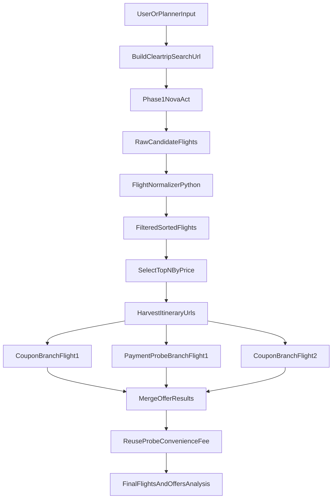
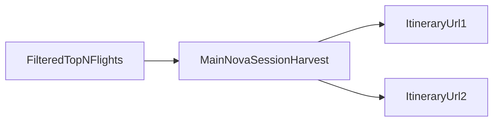
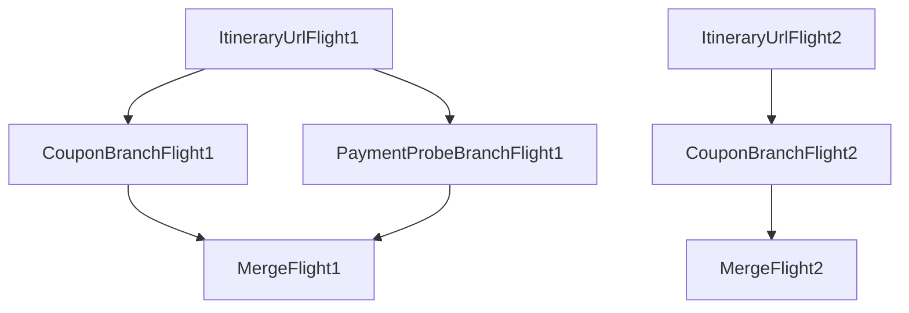

# Cleartrip Agent — Architecture, Flow and Timings

This document describes the current Cleartrip implementation after the March 2026 Phase 3 refactor:

- Phase 1 returns a raw, non-authoritative candidate list from the UI.
- Phase 2 applies authoritative filtering and sorting in Python.
- Phase 3 harvests itinerary URLs first, then runs independent Nova sessions in parallel:
  - coupon branch per analyzed flight
  - payment-probe branch only for the configured probe flight
- The final offer object is produced by merging those branch results.

---

## 1. Cleartrip in one diagram

---

## 2. Phase-by-phase flow

### Phase 1: Search and raw extraction

One Nova Act session opens the Cleartrip results page and runs the combined filter-and-extract prompt when time filters are present.

- URL construction encodes route, date, class, and `stops=0` when requested.
- The prompt applies sidebar TIMINGS checkboxes such as `Early morning` and `Morning`.
- The same act then scrolls the main results list and extracts visible flight cards.
- The returned rows are useful for observability, but they are still a candidate list and can over-include flights.

### Phase 2: Authoritative filtering

`FlightNormalizer` is the source of truth for filtered flights.

- Deduplicates flights.
- Applies `departure_window`, `arrival_window`, `max_stops`, and `sort_by`.
- Produces the canonical filtered list used for display and for selecting offer-analysis targets.

### Phase 3: Offer analysis

Phase 3 only runs when `fetch_offers=True`.

1. The agent selects the top `offers_top_n` flights from the Phase 2 filtered list, sorted by price ascending.
2. The main search session performs harvest only:
   - click `Book`
   - click fare-dialog `Continue`
   - stop on `Review your itinerary`
   - capture `itinerary_url`
3. After all harvest URLs are collected, new Nova sessions start from those itinerary URLs in parallel.

---

## 3. Current Phase 3 architecture

### Harvest stage

The main search session does not extract coupons or payment details. It only creates a stable starting point for later branches.

### Parallel branch stage

For the current `top 2` setup, three branch sessions are created:

- coupon branch for flight 1
- payment-probe branch for flight 1
- coupon branch for flight 2

### Why this branch split matters

The coupon branch and payment branch must not share one browser session, because coupon-dialog UI state can contaminate the payment flow. Starting both from the same itinerary URL in separate Nova sessions removes that coupling.

---

## 4. What each branch does

### Coupon branch

Starts directly on the itinerary URL and stays on the booking page.

1. Extract booking-page fare summary.
2. Extract coupons from the right-side coupon section.
3. Compute `price_after_coupon` for each coupon.
4. Compute `best_price_after_coupon`.

Output fields populated here:

- `fare_type`
- `original_price`
- `coupons`
- `best_price_after_coupon`
- booking-page `fare_breakdown`

### Payment-probe branch

Starts on the same itinerary URL, but continues deeper into the purchase flow.

1. Insurance continue.
2. Skip add-ons screen.
3. Skip add-ons confirmation popup if it appears.
4. Fill contact details.
5. Fill traveller details.
6. Reach payment page.
7. Extract final fare breakdown including `convenience_fee`.
8. Capture `payment` URL.

Output fields populated here:

- payment-page `fare_breakdown`
- `additional_urls.payment`
- payment-branch telemetry

### Merge step

The merged offer prefers:

- coupon branch for coupon data and booking-page fare type
- payment branch for payment URL and payment-page fare breakdown

Then `_apply_convenience_fee_from_first()` reuses the probe flight’s `convenience_fee` for the other analyzed offers when configured.

---

## 5. Data contract

### Raw flights

Raw flights are Phase 1 candidate rows. They are intentionally kept for visibility, but they are not the authoritative filtered set.

### Filtered flights

Filtered flights are the Phase 2 output from `FlightNormalizer`, and they are the authoritative source for:

- which flights match user criteria
- which flights can be chosen for offer analysis

### `offers_analysis`

Each analyzed offer returns:

- `flight_number`
- `airline`
- `original_price`
- `fare_type`
- `coupons[]`
- `fare_breakdown`
- `best_price_after_coupon`
- `additional_urls.itinerary`
- `additional_urls.payment` for the probe flight when payment succeeds
- `telemetry`

---

## 6. Fresh end-to-end timing snapshot

Fresh wrapper run:

- Route: `Bengaluru -> Hyderabad`
- Date: `2026-03-12`
- Filters: departure window `07:00-10:00`, `max_stops=0`, sort by departure
- Offers analyzed: top `2`

### Wall-clock summary

- Full end-to-end wrapper: about `289.9s`
- Phase 1 extract: about `41.3s`
- Harvest for 2 flights: about `58s`
- Parallel offer-analysis block: about `146.9s`

### Probe flight (`IndiGo 6E-537`)

- `fare_summary_ms`: `6916`
- `coupon_ms`: `40613`
- `coupon_branch_total_ms`: `64501`
- `insurance_continue_ms`: `21895`
- `skip_addons_ms`: `26879`
- `skip_addons_popup_ms`: `25531`
- `contact_continue_ms`: `22083`
- `traveller_continue_ms`: `28696`
- `payment_fare_extract_ms`: `5756`
- `payment_probe_ms`: `130844`
- `payment_probe_branch_total_ms`: `146930`
- `parallel_branch_wall_clock_ms`: `146938`

### Fresh full-run result for probe flight

- Real payment URL captured: yes
- Real convenience fee extracted: `365`
- Final payment-page total fare: `6012`

This fresh run matters because it confirms the current architecture works correctly on newly harvested itinerary URLs. A stale focused-itinerary URL can expire and produce misleading failures.

---

## 7. Current strengths

- The filtered list is now the source for choosing offer-analysis targets.
- Coupon extraction across harvested flights is parallel.
- Coupon extraction and payment probing for the probe flight are parallel.
- Payment probing uses a separate session, so coupon-dialog residue cannot poison payment navigation.
- One successful probe flight is enough to propagate convenience fee to the other analyzed offers.

---

## 8. Known limitations

- Phase 1 can still over-include raw candidate rows before Python filtering removes them.
- Coupon description quality is not fully consistent across all flights; some offers still return only the top line.
- Payment-probe timings are still the largest contributor to total runtime.
- The focused single-itinerary test is useful for debugging, but its harvested URL can expire and become an unreliable signal unless it is refreshed from a new wrapper run.

---

## 9. File map

- Agent logic: `backend/agents/cleartrip/agent.py`
- Agent config: `backend/agents/cleartrip/config.yaml`
- Phase 1 prompt: `backend/agents/cleartrip/instructions/extract_with_filter.md`
- Coupon prompt: `backend/agents/cleartrip/instructions/extract_coupons_from_booking_page.md`
- Booking fare prompt: `backend/agents/cleartrip/instructions/extract_fare_summary_booking.md`
- Payment prompts:
  - `backend/agents/cleartrip/instructions/payment_insurance_continue.md`
  - `backend/agents/cleartrip/instructions/payment_skip_addons.md`
  - `backend/agents/cleartrip/instructions/payment_skip_addons_popup.md`
  - `backend/agents/cleartrip/instructions/payment_contact_continue.md`
  - `backend/agents/cleartrip/instructions/payment_traveller_continue.md`
  - `backend/agents/cleartrip/instructions/extract_fare_breakdown.md`
- Full wrapper test: `backend/tests/test_cleartrip_agent.py`
- Focused itinerary test: `backend/tests/test_cleartrip_itinerary.py`
